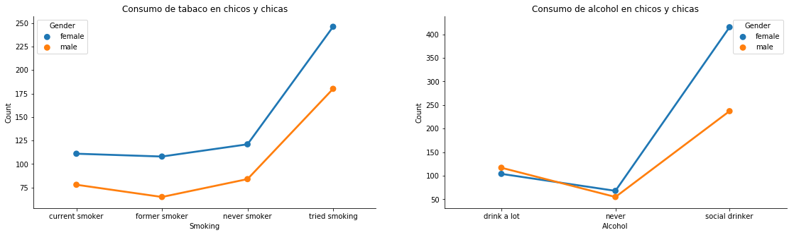

## Consumo de tabaco y de alcohol de los jóvenes

Se tomó una muestra de población, de aproximadamente 1000 individuos, formada por chicos y chicas con edad comprendida entre los 15 y los 26 años. Entre otros datos, que se reflejan, aparece el consumo de alcohol y de tabaco entre los jóvenes. El estudio se interesa en estas dos variables mencionadas.

Los siguientes gráficos muestran el consumo de alcohol y tabaco en función del género de los encuestados.

En la muestra se observa que las chicas son o no consumidoras de tabaco siguiendo el mismo patrón que los chicos. Se puede ver que el gráfico de lineas es casi idéntico. La diferencia es que el de la porción de población femenina está desplazado hacia arriba. Esto se debe a que los datos de la encuesta no están balanceados en cuanto al género. Esto quiere decir que fueron entrevistadas **1010** personas de las cuales **593** son chicas y **411** chicos, lo cual se muestra perfectamente en el gráfico de consumo de alcohol.

En el gráfico de consumo de alcohol se observa que las chicas y los chicos que consumen mucho alcohol es prácticamente igual. Pero, por lo que sabemos de la muestra, fueron entrevistadas más mujeres que hombres, por lo tanto, es un dato engañoso. En realidad, por las características de la muestra, la cantidad mujeres que toma mucho alcohol es menor a la de hombres de esta misma clase. Como consecuencia podemos decir que el hombre es más propenso al consumo excesivo de alcohol.
Se puede observar que las mujeres son más bebedoras sociales que los hombres. Esto se puede apreciar viendo la gran diferencia de cantidad en cuanto al género para la clase bebedor social.

Podemos afirmar, en general, que el consumo de tabaco entre hombres y mujeres sigue el mismo patrón mientras que, en lo que se refiere a consumo alcohol, los hombres son mas propensos al consumo excesivo y las mujeres son más bebedoras sociales.
